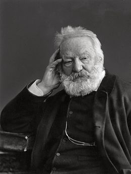

# **Après l’hiver Victor Hugo**

N’attendez pas de moi que je vais vous donner 
Des raisons contre Dieu que je vois rayonner ; 
La nuit meurt, l’hiver fuit ; maintenant la lumière, 
Dans les champs, dans les bois, est partout la première. 
Je suis par le printemps vaguement attendri.

1. Avril est un enfant, frêle, charmant, fleuri ;
2. Je sens devant l’enfance et devant le zéphyre
3. Je ne sais quel besoin de pleurer et de rire ;
4. Mai complète ma joie et s’ajoute à mes pleurs.
5. Jeanne, George, accourez, puisque voilà des fleurs.

+ Accourez, la forêt chante, l’azur se dore,
+ Vous n’avez pas le droit d’être absents de l’aurore.
+ Je suis un vieux songeur et j’ai besoin de vous,
+ Venez, je veux aimer, être juste, être doux,
+ Croire, remercier confusément les choses,

- Vivre sans reprocher les épines aux roses,
- Être enfin un bonhomme acceptant le bon Dieu.
- Ô printemps ! bois sacrés ! ciel profondément bleu !
- On sent un souffle d’air vivant qui vous pénètre,
- Et l’ouverture au loin d’une blanche fenêtre ;

On mêle sa pensée au clair-obscur des eaux ; 
On a le doux bonheur d’être avec les oiseaux 
Et de voir, sous l’abri des branches printanières, 
Ces messieurs faire avec ces dames des manières. 
26 juin 1878

Victor Hugo

[Wiki](https://fr.wikipedia.org/wiki/Victor_Hugo)
